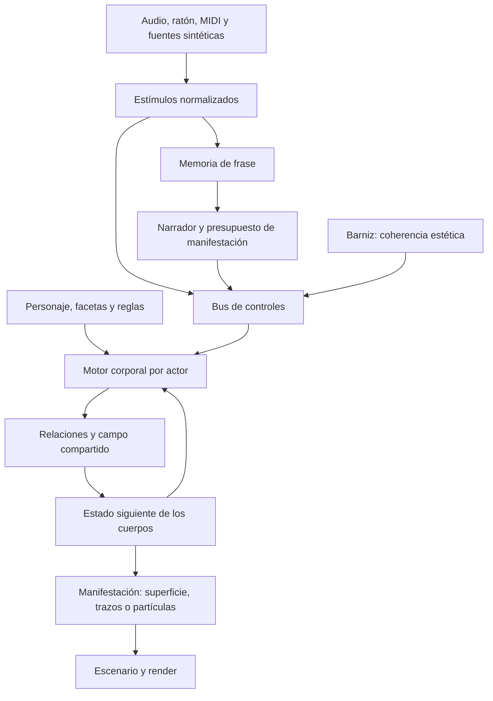

# MIA — Evaluación de arquitectura y continuidad conceptual

**Fecha:** 10 de septiembre de 2026.  
**Objeto:** evaluar la correspondencia entre la intención fundacional, la arquitectura disponible y el desarrollo de personajes con identidad, articulación interna y capacidad de fusión.  
**Estado:** informe de revisión y propuesta. No modifica el motor ni sustituye la Biblia conceptual.

## 1. Dictamen

**MIA conserva una parte importante de la dirección original, pero existe una brecha entre la profundidad de algunos generadores y la forma en que el instrumento permite actuar sobre ellos.** La infraestructura organiza bien recetas, actores, fuentes y memoria. Todavía no convierte esas piezas en un sistema común de desarrollo corporal y relaciones materiales.

El temor a terminar con figuras que palpitan o se desplazan tiene fundamento concreto: el vocabulario accesible durante la actuación favorece transformaciones generales y unas pocas expresiones. Sin embargo, reducir todo lo construido a bloques estáticos sería incorrecto. Serpiente y Caracol ya contienen procedimientos locales que calculan posiciones y detalles desde atributos, coordenadas y funciones matemáticas. El problema es que esa profundidad está encapsulada, se aprovecha parcialmente y no puede relacionarse corporalmente con otros actores.

La recomendación es **reorientar el siguiente hito hacia una prueba de desarrollo interno y fusión recuperable**, antes de ampliar captura, cámara o dirección automática. Se conservan los salones, las fichas, el bus, el transporte y los órganos temporales; se añade la capa que falta entre la dirección y la imagen: un cuerpo generativo con estado, capacidades y relaciones explícitas.

La prueba decisiva será sencilla de describir: con cámara, posición, rotación y escala global inmóviles, un personaje debe desarrollarse, articular regiones de su cuerpo, responder de manera distinta según su historia y participar en una continuidad material de la que pueda separarse sin perder su identidad.

## 2. Criterio de lectura y alcance de la evidencia

La [Biblia conceptual](/Users/gorcap/Claude/Projects/Mia/BIBLIA_CONCEPTUAL.md) establece la jerarquía: orienta al plan estratégico. Sus principios de autoría, memoria, génesis y matemática compartida son el criterio de esta evaluación. El [Anexo de energía](/Users/gorcap/Claude/Projects/Mia/BIBLIA_ANEXO_ENERGIA.md) precisa la coherencia estética, pero sitúa su energía en un vector de parámetros; no describe todavía una dinámica espacial del cuerpo.

Tu planteamiento actual añade una precisión importante: la identidad debe contener **reglas de desarrollo**, no quedar ligada exclusivamente a una forma completa. La articulación «celular» se entiende aquí como organización matemática local y multiescala. No exige simular células biológicas ni resolver un fluido físicamente exacto. Sí exige que las partes tengan comportamiento y relaciones que expliquen cómo cambia el conjunto.

Se han contrastado README, plan estratégico, ruta al videoclip, guía de uso, plan de Barniz, ruta de pruebas, sesión SNC y el esquema general, junto con los contratos, motores, salones y flujo de camerino. Las referencias de código corresponden a las líneas presentes en esta revisión; los nombres de métodos permiten localizarlas si después cambian.

Se distinguen tres niveles de evidencia:

- **Documentado:** intención o resultado registrado en los documentos. Las verificaciones históricas se atribuyen a su bitácora.
- **Comprobado por inspección:** comportamiento identificable en el código actual, sin afirmar que se haya ensayado visualmente en esta revisión.
- **Propuesto o pendiente de observación:** arquitectura futura, hipótesis estética y pruebas necesarias. No se presentan como resultados alcanzados.

Esta revisión no ejecutó una actuación en navegador, no midió FPS o latencia y no volvió a realizar las pruebas históricas. Tampoco asigna un porcentaje global: mezclar el buen estado del almacenamiento con la ausencia de fusión daría una cifra poco informativa.

## 3. Correspondencia con la idea original

| Principio | Evidencia | Correspondencia actual | Limitación relevante | Cambio recomendado |
|---|---|---|---|---|
| Autoría del vocabulario | Biblia II.5; recetas de salón, fichas y repertorios [E1, E2] | Clara en la estructura | Un catálogo autorizado no garantiza por sí mismo transformaciones con identidad | Autorizar también reglas, regiones y límites de transformación |
| Identidad persistente | Ficha con receta; actor con ID y retorno al camerino [E1, E2, E3] | Parcial | No hay entidad que reúna facetas y desarrollo; el ID de ficha no se conserva como vínculo explícito en la copia del actor | Separar personaje, revisión, faceta e instancia escénica |
| Génesis reversible | Biblia III; apertura y siete bandas de Semilla [E4] | Parcial en control; insuficiente como geometría | Interpolar mínimos no garantiza silencio, línea, superficie o volumen | Un protocolo geométrico de desarrollo por familia |
| Memoria y dramaturgia | Acumuladores, Narrador y orden de motores [E5] | Base funcional acotada | Memoria resumida de actividad; falta estado corporal distribuido y reconocimiento de motivos | Añadir memoria local sin atribuir comprensión musical al resumen actual |
| Matemática compartida | Biblia II.4; superformula y coordenadas paramétricas [E6] | Presente en generación; incipiente en traducción musical | Simetría y proporción existen, pero el oído actual no extrae armonía o timbre suficientes para los vínculos propuestos | Ensayos de relaciones explícitas, con fuentes sintéticas primero |
| Articulación interna | Serpiente, Caracol y relieve localizado [E6, E7] | Real, pero desigual y encapsulada | Los hilos públicos no alcanzan gran parte de esas capacidades; falta propagación con memoria local común | Motor corporal y catálogo de capacidades por familia |
| Interacción externa | Ratón, audio nivel/ataque, MIDI y rutas suavizadas [E8] | Operativa como modulación | Una fuente suele perseguir un valor escalar; faltan excitaciones regionales y relaciones entre cuerpos | Fuentes → estímulos → procesos locales, con límites temporales |
| Coherencia del mundo | Barniz, energía y temperatura; anexo II–V [E9] | Implementación parcial | Faltan conexiones y semántica explícita para presencia, paleta y carga; energía de parámetros no equivale a materia común | Consolidar el Barniz y distinguirlo de la energía corporal |
| Fusión y constelación | Biblia III; Escenario de instancias [E3] | Coexistencia disponible; fusión ausente | Agrupar y superponer objetos no crea continuidad material | Relaciones y adaptadores de interacción con compatibilidad declarada |

### Evidencias de referencia

- **E1 — Recetas:** [Salon.ts, `FichaParaSalon` y contrato de salón](/Users/gorcap/Claude/Projects/Mia/src/core/Salon.ts:99); [Fichas.ts, identidad de almacenamiento](/Users/gorcap/Claude/Projects/Mia/src/core/Fichas.ts:7).
- **E2 — Actor y copia:** [DocumentoEscena.ts, `ActorEscena`](/Users/gorcap/Claude/Projects/Mia/src/core/DocumentoEscena.ts:31); [creación y copia de ficha](/Users/gorcap/Claude/Projects/Mia/src/core/DocumentoEscena.ts:102). `copiarFicha` conserva receta, hilos, gestos y extra; no conserva una referencia de catálogo a la ficha original.
- **E3 — Escenario:** [montaje independiente](/Users/gorcap/Claude/Projects/Mia/src/salones/escenario/EscenarioSalon.ts:143); [actualización y transformaciones](/Users/gorcap/Claude/Projects/Mia/src/salones/escenario/EscenarioSalon.ts:299); [retorno al camerino](/Users/gorcap/Claude/Projects/Mia/src/shell/Galeria.ts:62).
- **E4 — Semilla:** [bandas dimensionales](/Users/gorcap/Claude/Projects/Mia/src/core/Semilla.ts:28); [`manifestar`](/Users/gorcap/Claude/Projects/Mia/src/core/Semilla.ts:124); [selección de ejes](/Users/gorcap/Claude/Projects/Mia/src/main.ts:101).
- **E5 — Memoria:** [actividad y acumulación](/Users/gorcap/Claude/Projects/Mia/src/core/Acumuladores.ts:146); [deliberación del Narrador](/Users/gorcap/Claude/Projects/Mia/src/core/Narrador.ts:158); [orden de evaluación](/Users/gorcap/Claude/Projects/Mia/src/main.ts:138).
- **E6 — Generación:** [catálogo expresivo de Formas Exóticas](/Users/gorcap/Claude/Projects/Mia/src/salones/supershapes/SupershapesSalon.ts:32); [Caracol local](/Users/gorcap/Claude/Projects/Mia/src/salones/supershapes/SupershapesSalon.ts:625); [Serpiente local](/Users/gorcap/Claude/Projects/Mia/src/salones/supershapes/SupershapesSalon.ts:914).
- **E7 — Otras familias:** [relieve desde estela](/Users/gorcap/Claude/Projects/Mia/src/salones/bajorelieve/BajoRelieveSalon.ts:189); [topología y uniforms de Delaunay](/Users/gorcap/Claude/Projects/Mia/src/salones/delaunay/DelaunaySalon.ts:143); [actualización de Trazo](/Users/gorcap/Claude/Projects/Mia/src/salones/crosshatch/CrossHatchSalon.ts:117).
- **E8 — Traducción:** [fuentes y rutas de Sinestesia](/Users/gorcap/Claude/Projects/Mia/src/core/Sinestesia.ts:187); [formas temporales de Gestos](/Users/gorcap/Claude/Projects/Mia/src/core/Gestos.ts:114).
- **E9 — Coherencia:** [paso del Barniz](/Users/gorcap/Claude/Projects/Mia/src/core/Barniz.ts:200); [energía](/Users/gorcap/Claude/Projects/Mia/src/core/Barniz.ts:258); [presencia y escritura de VectorEstado](/Users/gorcap/Claude/Projects/Mia/src/core/VectorEstado.ts:46).

## 4. Dónde se produce el alejamiento

### 4.1. Una anatomía matemática existe, pero llega poco al instrumento

Clásica y SuperFlor evalúan posiciones sobre una retícula paramétrica. Serpiente guarda atributos de identidad y calcula posiciones en el shader. Caracol calcula concha, picos, pelos, gotas y trazos desde coordenadas y atributos locales. Mantener fija la conectividad o el número de muestras puede ser una buena decisión de rendimiento: **la organicidad depende de las leyes que actúan sobre ese soporte, no de regenerar continuamente sus buffers**.

Lo que falta no es añadir ruido indiscriminadamente. Un ruido dependiente del tiempo produce variación, pero no garantiza propagación, memoria local, desarrollo o respuesta de una región a otra. Las funciones de Caracol son una base generativa valiosa; no constituyen todavía un tejido con estado local persistente.

Además, los tres hilos internos de Formas Exóticas son `escala`, `giro` y `puntoTam`. La escala se aplica mediante `grupo.scale.setScalar` [código](/Users/gorcap/Claude/Projects/Mia/src/salones/supershapes/SupershapesSalon.ts:300). El rótulo «respiración interna» describe una intención que ese mecanismo no satisface corporalmente. El filtro de [Galeria.destinosModulables](/Users/gorcap/Claude/Projects/Mia/src/shell/Galeria.ts:91) también restringe la mesa del camerino al catálogo seleccionado: la limitación no aparece solo al subir al escenario.

Los gestos actuales interpolan extremos mediante una curva lineal o suave; admiten canales múltiples en el contrato, aunque el editor construye uno por gesto. Al reproducir un gesto se detiene el anterior del mismo ámbito [MotorGestos](/Users/gorcap/Claude/Projects/Mia/src/core/Gestos.ts:55). Son un primer repertorio útil. Cambiarles el nombre a «floración» o «metamorfosis» no los convierte en procesos de desarrollo.

### 4.2. La Semilla confunde un presupuesto con su realización

La apertura puede seguir siendo un mando global válido. El problema es aplicar el mismo mecanismo a cualquier eje numérico: mínimo de rotación puede ser una rotación negativa; mínimo de escala puede seguir siendo un cuerpo visible; un selector no describe una trayectoria continua.

`manifestar()` escribe un desplazamiento respecto a la base. No apaga al actor ni crea ejes geométricos específicos. Otras modulaciones pueden seguir contribuyendo al resultado. Por tanto, apertura cero no asegura silencio visual, y el tránsito por siete nombres no demuestra una ontogénesis de siete manifestaciones.

Esto afecta al núcleo de la Biblia III: el punto y la constelación deben proceder de la misma arquitectura. La revisión propone conservar el mando y reemplazar su traducción indiscriminada por capacidades explícitas de cada cuerpo.

### 4.3. El Escenario relaciona colocaciones, no cuerpos

La instancia independiente de salón evita contaminación entre actores y debe conservarse donde sea útil. Sin embargo, el contrato `Salon.update(dt, tiempo, params)` no entrega vecindades, campos compartidos, puertos de contacto o estado de otro cuerpo. El Escenario recorre cada actor y aplica su transformación.

Por ello no puede resolver por sí mismo una fusión. Tampoco debe conseguirla accediendo desde un salón a los uniforms privados de otro. La relación necesita existir como parte explícita de la escena, con un motor que evalúe la interacción y capacidades declaradas por ambos participantes.

### 4.4. La memoria disponible todavía resume actividad

Los acumuladores leen actividad manual o variaciones de una dirección del bus. Sus magnitudes llamadas tensión y densidad no equivalen todavía a tensión armónica o densidad de notas reconocidas. El Narrador v1 decide con umbrales de tensión y meseta, transiciona Barniz y sesga temperatura; su integración con Semilla existe.

Esto aporta una respuesta con historia, pero no permite afirmar que reconoce motivos, comprende secciones o desarrolla partes corporales. Conviene conservar nombres expresivos en la interfaz y documentar qué señal representa realmente cada uno.

### 4.5. El Barniz necesita consolidación antes de extender su responsabilidad

Hay una diferencia entre **coherencia de parámetros**, que regula el mundo estético, y **coherencia espacial**, que regula relaciones dentro y entre cuerpos. El Barniz debe mantener la primera función. La segunda pertenece al motor corporal y a las relaciones.

La inspección identifica además asuntos concretos:

| Observación del código | Consecuencia y tratamiento propuesto |
|---|---|
| `ejesDelSalon()` deduce familias mediante palabras del nombre y trata `color` como circular [main.ts](/Users/gorcap/Claude/Projects/Mia/src/main.ts:101) | Si recibe un color RGB empaquetado, dividirlo por su máximo no produce un tono perceptual. Declarar semántica de color explícita; no confiar en coincidencias de nombres. |
| `EjeVector.presencia` existe, pero la construcción automática de ejes no la asigna [VectorEstado](/Users/gorcap/Claude/Projects/Mia/src/core/VectorEstado.ts:17) | No dar por hecho que los actores invisibles quedan descontados de la carga. Conectar presencia real; el booleano de actor no es hoy una dirección continua del bus. |
| Los pesos de carga y acoplamientos iniciales están vacíos [Barniz](/Users/gorcap/Claude/Projects/Mia/src/core/Barniz.ts:37) | Armar el Barniz no basta para obtener todos los efectos del anexo; cada receta necesita relaciones y pesos efectivos. |
| `k.e1` y `k.e1b` se guardan e interpolan, pero el cálculo E1 usa `ac.k`; no aparece el término cuártico previsto [energía](/Users/gorcap/Claude/Projects/Mia/src/core/Barniz.ts:258) | Completar o corregir el contrato y sus controles antes de atribuirles efectos. Separar también saturación y rango cromático: hoy ambas variables reciben el mismo máximo de los ejes no circulares de paleta. |
| `VectorEstado` lee el final compuesto y escribe `objetivo − base` [lectura/escritura](/Users/gorcap/Claude/Projects/Mia/src/core/VectorEstado.ts:41) | Con otras fuentes activas, el bus vuelve a sumar sus aportaciones. Debe definirse y probarse la composición para que no reintroduzca involuntariamente el empuje externo. |
| Las anclas se interpolan linealmente [mezcla](/Users/gorcap/Claude/Projects/Mia/src/core/Barniz.ts:55), aunque el tono se considera circular | Una transición entre tonos cercanos al cierre del círculo puede recorrer un arco largo. Incorporar interpolación circular y correspondencias de anclas explícitas. |

El problema de composición admite un ejemplo algebraico sin ensayo visual: base `b`, aporte externo `m` y corrección previa `c` producen `s=b+m+c`. Si el siguiente objetivo es `o` y se guarda `o-b`, el final será `o+m`, no `o`. Una corrección persistente que deba alcanzar `o` debe descontar también los aportes externos presentes. Antes de cambiarlo se debe fijar si el Barniz integra un empuje o corrige un objetivo: son modelos distintos.

La protección de paleta también debe verificarse en la evaluación de rutas, no solo en el selector. [Sinestesia.tick](/Users/gorcap/Claude/Projects/Mia/src/core/Sinestesia.ts:187) no consulta las direcciones protegidas; la exclusión visible se establece al construir el panel en [main.ts](/Users/gorcap/Claude/Projects/Mia/src/main.ts:95). Una ruta ya guardada requiere validación explícita.

Estas observaciones no invalidan la idea del paisaje de energía. Identifican qué debe estabilizarse para que sus resultados puedan evaluarse con claridad.

## 5. Diferencias entre documentación, código y pruebas

| Declaración o dirección documental | Lo que permite sostener el estado actual | Enmienda recomendada |
|---|---|---|
| Biblia VII y anexo VI muestran varios órganos como pendientes | Sus núcleos ya están presentes | Mantener el texto fundacional y remitir a una tabla de estado fechada |
| Plan estratégico, Etapa 7, mantiene la dirección de Semilla entre pendientes | `main.ts` entrega `objetivoApertura` del Narrador a Semilla | Marcar esa conexión como implementada; separar de la génesis geométrica pendiente |
| Bitácora F–H registra pruebas headless satisfactorias | Son antecedentes técnicos; las propias rondas dejan observación humana pendiente | Conservar el registro, sin promoverlo a validación estética |
| Semilla H1–H8 comprueba bandas, apertura y sensación de viaje | Falta demostrar dimensionalidad corporal con otras modulaciones activas | Añadir pruebas de forma, silencio real y continuidad |
| P19 valida un gesto corporal de respiración | Demuestra transporte de repertorio y aplicación por actor; el hilo probado escala el grupo | Precisar qué capacidad se validó y añadir articulación regional |
| Comentarios de Serpiente afirman que el Escenario avanza su fase | El runtime inspeccionado transmite `paramsActor`; `actualizarSerpiente` toma `p.fase`, y no se identifica avance de esa fase en el loop de actores | Verificar y corregir esa discrepancia. No asumir que «dinámico» garantiza evolución autónoma de Serpiente |
| Ruta al videoclip §9 prioriza registro, cámara y captura | Es una ruta válida de producción, pero no prueba desarrollo ni fusión | Introducir primero el hito corporal descrito en este informe |
| Pruebas antiguas indican ausencia de export de Delaunay | La plantilla actual del Escenario sí contiene reconstrucción de Delaunay | Reauditar paridad por familia y versión; no reutilizar matrices antiguas como inventario actual |

Referencias: [Plan estratégico, etapas](/Users/gorcap/Claude/Projects/Mia/PLAN_ESTRATEGICO.md); [Ruta de pruebas, P19 y bloques F–H](/Users/gorcap/Claude/Projects/Mia/RUTA_DE_PRUEBAS.md); [Sesión SNC](/Users/gorcap/Claude/Projects/Mia/SESION_DE_PRUEBAS_SNC.md); [Ruta al videoclip, §§7–9](/Users/gorcap/Claude/Projects/Mia/RUTA_AL_VIDEOCLIP.md); [fase de Serpiente](/Users/gorcap/Claude/Projects/Mia/src/salones/supershapes/SupershapesSalon.ts:873); [exportador independiente](/Users/gorcap/Claude/Projects/Mia/src/salones/escenario/EscenarioSalon.ts:478).

La diferencia entre comentarios, pruebas históricas y código también obliga a evitar un diagnóstico basado solamente en los nombres: «dinámico», «interno», «semilla» y «floración» necesitan un comportamiento verificable asociado.

## 6. Arquitectura propuesta: identidad, desarrollo y manifestación

### 6.1. Cinco conceptos separados

| Concepto | Responsabilidad | Ejemplo en Caracol |
|---|---|---|
| Personaje | Identidad autoral y reglas admisibles | Organización espiral, proporciones características y forma de articular su piel |
| Faceta | Región reconocible de su repertorio | Concha desnuda, peluda, con picos o con trama |
| Desarrollo | Grado y distribución de capacidades desplegadas | Germen, espiral incipiente, superficie extendida, cuerpo con regiones diferenciadas |
| Estado corporal | Memoria y variables vivas de una instancia | Excitación por región, fase, recuperación y propagación de un estímulo |
| Actor y papel | Presencia de ese personaje en una obra | Una instancia protagonista y otra coral, cada una con pose, relaciones y presupuesto |

La faceta no será sinónimo de edad: un Caracol incipiente puede presentar una piel distinta de otro adulto. La madurez tampoco será una escala uniforme. Desarrollará extensión, diferenciación regional y capacidad de articulación, dentro de reglas que el autor reconozca como propias.

Las invariantes deben ser pocas y explícitas. Para el piloto se propone conservar el sentido de enrollamiento, la relación característica entre eje y vueltas y la organización de la piel respecto a la concha. Se guardarán además tres referencias visuales aprobadas —germen, desarrollo intermedio y plenitud—. Es una propuesta de diseño; la validez estética de esas invariantes necesita tu juicio.

### 6.2. Flujo de evaluación



El diagrama representa un paso de simulación: las relaciones leen un estado común y producen el siguiente. Ningún actor debe ver parcialmente actualizado al otro por el orden del array del Escenario.

El bus conservará las bases autorales y transportará pocos controles significativos. Los buffers locales pertenecen al motor corporal: miles de celdas no deben convertirse en miles de sliders o direcciones del bus. Los salones seguirán siendo talleres de familias, mientras sus generadores podrán usarse desde un runtime de cuerpo separado de la interfaz.

### 6.3. Una dinámica local mínima y suficiente

Para Caracol se propone comenzar con una retícula persistente de excitación sobre sus coordenadas longitudinal y transversal. El puntero deposita un estímulo cerca del punto de contacto; el audio excita regiones según una máscara autoral. Cada región propaga y recupera actividad. Esa actividad modifica curvatura, apertura o despliegue de la piel, sin alterar la pose global.

Un modelo inicial, propuesto para experimentar, es:

```text
de_i/dt = D · Σ_j w_ij (e_j − e_i) − λ · e_i + estímulo_i
X_i     = G(coordenada_i, identidad, desarrollo, faceta, e_i)
```

`e_i` es excitación local; `j` recorre vecinos; `D` gobierna propagación y `λ` recuperación. `G` sigue siendo una función escrita por el autor. Este modelo añade distribución y memoria; no pretende simular un fluido completo. No se necesita un número inmenso de estados para probar el principio.

La integración usará pasos de simulación controlados, límites de estabilidad y vecindades definidas según el cuerpo. La costura angular debe cerrarse donde corresponda; un borde abierto tendrá una condición explícita. Si se usa integración explícita, el paso y `D` deben respetar una cota compatible con los pesos de vecindad; aumentar el frame time no puede multiplicar libremente el paso físico.

El desarrollo modifica el dominio manifestado y la diferenciación, mientras la excitación modula su comportamiento. Se conservará un estado de referencia por muestra y una semilla estable para impedir que un cambio de calidad invente otro individuo. El uso actual de `Math.random()` al construir detalles [Caracol](/Users/gorcap/Claude/Projects/Mia/src/salones/supershapes/SupershapesSalon.ts:445) y [Serpiente](/Users/gorcap/Claude/Projects/Mia/src/salones/supershapes/SupershapesSalon.ts:814) requiere sustituirse por identidad reproducible antes de validar recuperación.

### 6.4. Hilos expresivos que conviene desbloquear

La primera ampliación debe ser específica de familia y distinguir parámetros continuos de selectores y reconstrucciones.

| Familia | Candidatos a expresión | Tratamiento necesario |
|---|---|---|
| Clásica | Perfiles `n`, proporciones `a/b`, dominio angular, factor Z | Rangos autorales y control de degeneraciones; no asumir que todos los recorridos intermedios son bellos o estables |
| SuperFlor | Curvatura de tallo, perfil de hoja y amplitud | Mapear a crecimiento/apertura coherentes; evitar escalas descoordinadas |
| Serpiente | Fase, longitud, torsión y perfiles | Unificar avance temporal y declarar fronteras de la envolvente |
| Caracol | Fase, vueltas, curva Z, intensidad, densidad y despliegue de piel | Separar edad, faceta y excitación; convertir la selección discreta de variantes en transiciones definidas |
| Delaunay | Extrusión y comportamiento local de celdas | Mantener triangulación y reseed fuera de la ruta rápida; introducir vecindad si se desea propagación |
| Trazo / Bajo Relieve | Materia gráfica y revelado localizado | Mantener su identidad; un GLB necesita un adaptador corporal específico para fusión |

Estas son candidaturas de implementación, no una certificación de seguridad de todos los valores actuales. La superformula permite familias amplias de formas, pero la relación entre variación de parámetros y cambio perceptivo puede ser difícil de controlar; la exploración necesita restricciones autorales. [Referencia de Paul Bourke sobre supershapes](https://www.paulbourke.net/geometry/supershape/).

## 7. Semilla: del presupuesto global al desarrollo del cuerpo

Cada familia declarará cómo responde a manifestación cero y cómo despliega sus dimensiones. El motor global decide cuánto puede manifestarse; el cuerpo decide cómo realizarlo.

Para Caracol, la secuencia propuesta es:

1. **Silencio:** contribución visual nula; identidad y memoria recuperable permanecen latentes.
2. **Punto:** germen situado en el origen de crecimiento de la espiral.
3. **Línea:** extensión de la curva generadora, conservando dirección y proporción.
4. **Curva desarrollada:** despliegue de vueltas y articulación longitudinal.
5. **Superficie:** apertura transversal alrededor de la curva, con piel aún poco diferenciada.
6. **Cuerpo pleno:** volumen perceptible, relieve y articulación regional. Si se requiere interior volumétrico real, lo aportará el adaptador de campo; una superficie envolvente no debe confundirse con materia simulada en todo su interior.
7. **Constelación:** varios cuerpos y relaciones subordinados a una misma génesis escénica; no aumentar simplemente el tamaño de uno.

Las etapas compartirán coordenadas y reglas. Al cruzar de curva a superficie, las dimensiones nuevas se abrirán de manera continua y con tratamiento de normales y espesor para evitar singularidades visibles. La resolución será un control de calidad independiente; Puntos/Alambre/Caras serán modos de representación, no edades.

El repliegue reducirá las capacidades manifestadas. La vuelta al silencio no borrará la receta ni el estado recuperable por accidente. El reinicio de actuación sí podrá restablecer un estado inicial guardado, como una decisión distinta de la disolución durante la obra.

## 8. Fusión con identidad recuperable

### 8.1. Niveles que deben distinguirse

| Nivel | Qué ocurre | Qué demuestra |
|---|---|---|
| Convivencia | Dos actores comparten encuadre | Composición |
| Sincronización | Comparten fase, proporciones o respuesta | Relación temporal |
| Deformación mutua | La cercanía altera regiones de ambos | Interacción corporal |
| Intercambio | Elementos o excitación atraviesan la frontera conservando procedencia | Relación material o de estado, según lo intercambiado |
| Continuidad material | Se forma una superficie o región de densidad común | Fusión geométrica en la representación adoptada |

La primera implementación no debe anunciar «fusión» si únicamente cambia opacidades o superpone mallas. Tampoco basta que dos personajes se conviertan en masas lisas indistinguibles: debe evaluarse cuánto de su organización sobrevive.

### 8.2. Comparación de representaciones

| Vía | Ventaja en MIA | Límite | Papel recomendado |
|---|---|---|---|
| Correspondencia paramétrica | Conserva coordenadas, detalle y fórmulas de una familia | Necesita correspondencia; interpolar vértices no cambia por sí mismo la conectividad ni une cuerpos arbitrarios | Desarrollo, facetas y deformación local |
| Partículas con procedencia | Permiten transporte y vecindad sin una malla rígida fija | Una nube no garantiza superficie continua; cohesión, vecinos y reconstrucción tienen coste | Intercambio granular y extensiones futuras |
| Campo implícito de densidad o distancia | Puede representar regiones que se unen y separan | Requiere adaptadores; detalle fino, contornos, normales y materiales pueden degradarse | Primera prueba de continuidad material entre cuerpos compatibles |

La literatura de simulación por partículas distingue la dinámica de las partículas de la reconstrucción de su superficie; ambas decisiones son necesarias para obtener un cuerpo visible continuo. Esto respalda tratar transporte y manifestación como responsabilidades separadas. [Müller, Charypar y Gross, *Particle-Based Fluid Simulation for Interactive Applications*](https://matthias-research.github.io/pages/publications/sca03.pdf).

La elección propuesta para MIA es **híbrida**: conservar superficies paramétricas para la identidad y el desarrollo, y añadir un campo compartido para relaciones que necesiten continuidad material. Esta es una recomendación de arquitectura, no una capacidad ya probada en el proyecto.

### 8.3. Primer experimento concreto

Comenzar con dos Caracoles de identidad distinta sobre la misma familia matemática. Cada adaptador producirá una envolvente de densidad a partir de muestras de su superficie y un espesor autoral explícito. El campo no se llamará SDF: una densidad muestreada no es automáticamente una distancia exacta.

En una región de interacción se combinarán las contribuciones con un operador de unión suave elegido para el prototipo, controlado por un peso de relación. La isosuperficie se extraerá sobre una rejilla acotada mediante marching cubes. Esto permite medir continuidad y cambio de conectividad antes de decidir una implementación de producción en GPU. La resolución del prototipo se elegirá por la capacidad de conservar los rasgos del Caracol y se registrará junto con el coste; no se prometerá tiempo real antes de medirlo.

Se conservarán los campos originales y pesos de procedencia para reconstrucción y material. La unión se limitará inicialmente a una zona marcada de cada cuerpo. La piel exterior a esa zona mantendrá su generador; el material de la zona común usará procedencia y Barniz para conservar coherencia. La transición entre superficie original y reconstruida deberá compararse sin efectos de cámara o postprocesado que oculten errores.

Después se ensayará **Caracol + SuperFlor**. La SuperFlor es una superficie abierta: su adaptador necesitará espesor declarado, no una suposición de interior cerrado. Si pierde su carácter al engrosarla, el resultado invalida ese adaptador para esa faceta; no justifica convertir todo el catálogo al mismo material.

Un GLB, una trama Delaunay o un efecto de tinta no adquirirá fusión automáticamente. Podrá participar en niveles inferiores o declarar que no ofrece continuidad material. Es mejor una capacidad explícitamente limitada que una falsa universalidad.

### 8.4. Qué significa recuperar al personaje

Se preservarán identidad, revisión de receta, coordenadas de referencia, semilla y estado anterior a la interacción. La relación tendrá su propio estado, sin sobrescribir esos datos. Al separarse, cada actor recorrerá una transición hacia su estado recuperable y recuperará su propia manifestación.

El modo inicial será **recuperación del estado anterior al encuentro**, mediante checkpoint y transición controlada. No se afirmará invertir matemáticamente una dinámica disipativa. Más adelante podrá existir separación con memoria de la experiencia, pero será una política distinta y explícita.

No se creará un tercer personaje automáticamente. La elección confirmada para este informe es continuidad recuperable. Si se desea conservar una mezcla como nueva obra de catálogo, será una operación autoral posterior.

## 9. Guion, roles y camerino

### 9.1. La interacción externa dirige procesos

La cadena propuesta es estímulo → proceso corporal → manifestación. Por ejemplo, un ataque excita una región; esa excitación se propaga según el cuerpo; la frase acumulada permite abrir nuevas regiones; la proximidad a otro actor modifica una relación autorizada. El mismo estímulo puede producir consecuencias distintas según la madurez, el papel y la memoria del personaje.

Un gesto ensayado podrá definir región, intención, duración y límites, además de una envolvente. La dinámica local decide el recorrido concreto. Se conservarán los gestos escalares existentes, pero se distinguirán de los procesos corporales.

El anexo V reserva mezcla de universos al Narrador. La ampliación propuesta mantiene esa separación temporal: **el autor establece qué relaciones existen y hasta dónde pueden llegar; el Narrador o un control manual autoriza su desarrollo profundo; los estímulos rápidos excitan esas relaciones dentro del permiso vigente**. Una señal de audio puede gobernar mezcla mediante memoria de frase, no por una conexión sin filtro del golpe al cambio de universo.

Una escena puede contener varios personajes y mantener monogénesis: comparten un origen de manifestación, relaciones y reglas del mundo. No se impone un único objeto visible; se evita encadenar universos sin continuidad. Esta interpretación requiere incorporarse como aclaración explícita de Biblia II.3 y III.

### 9.2. Principal, secundario y fondo

El papel pertenece a la obra. El personaje puede sugerir afinidades —gran legibilidad como solista, riqueza coral, capacidad ambiental—, pero no debe quedar condenado a una jerarquía fija.

El papel regulará presupuesto de atención: amplitud y frecuencia de cambio, extensión espacial, prioridad de respuesta y profundidad de relaciones. Un fondo puede tener dinámica interna rica y lenta; un protagonista puede sostener el silencio. La importancia escénica no se medirá por cuánto se mueve.

### 9.3. Camerino amplio por personaje

Crear una vista dedicada dentro de MIA, accesible desde la cajonera y desde el actor. El centro será una previsualización amplia; la navegación reunirá **Identidad, Desarrollo, Facetas, Materia, Comportamiento y Ensayo**. No se necesita crear un sitio o aplicación independiente.

La vista permitirá comparar referencias del mismo personaje, recorrer madurez, ensayar propagación con ratón o señal sintética, bloquear la pose y visualizar regiones sensibles. Un ensayo de encuentro abrirá una segunda instancia temporal sin alterar la escena guardada.

Editar desde el escenario conservará ID, pose, papel, visibilidad y relaciones compatibles. «Devolver a escena» aplicará la revisión a esa instancia. «Guardar revisión del personaje» será una operación separada; no cambiará silenciosamente todas las obras que usan una revisión anterior. Las facetas serán parte del personaje, no fichas sueltas cuya relación solo recuerda el autor.

## 10. Contratos mínimos y compatibilidad

Los nombres siguientes son propuestas de contrato, no interfaces implementadas. Su finalidad es separar responsabilidades antes de decidir todos los detalles de serialización.

| Contrato | Información mínima | Responsabilidad |
|---|---|---|
| `Personaje` | ID estable, revisión, familia generadora, semilla, invariantes, receta base, facetas y reglas de desarrollo | Define quién es y qué transformaciones admite |
| `Faceta` | ID, nombre, configuración o región de estados y transiciones admitidas | Describe una manifestación reconocible; no implica necesariamente otro cuerpo |
| `EstadoCorporal` | Actor, tiempo de simulación, desarrollo, estado local y referencia recuperable | Mantiene la vida de una instancia; los buffers no se vuelcan al bus |
| `CapacidadInteraccion` | Tipo, regiones/puertos, representación y compatibilidades | Declara qué puede aportar un cuerpo a una relación |
| `RelacionEscenica` | ID, actores participantes, capacidades elegidas, intensidad, región y política de recuperación | Conserva el encuentro como parte de la obra |

El runtime corporal ofrecerá operaciones de inicialización desde receta, avance con estímulos y estado previo, muestreo de representación, captura/restauración de estado y liberación de recursos. Las relaciones se evaluarán en dos fases: leer estados previos y calcular aportes; después aplicar el siguiente estado a todos los participantes.

La persistencia debe distinguir **obra preparada** y **estado vivo recuperable**. Guardar una escena no significará serializar por defecto cada buffer de simulación. Los checkpoints de encuentros serán propios de la sesión o del registro de actuación, con versión del motor y semillas.

Migración recomendada:

- Conservar el lector de DocumentoEscena v1/v2/v3 y escribir un formato posterior solo al introducir los nuevos contratos. Las obras antiguas mantendrán su representación y comportamiento de legado.
- Convertir una ficha existente en un personaje con una faceta inicial al adoptarla en el nuevo sistema. Mantener su receta original como referencia.
- Para actores antiguos sin vínculo de origen verificable, crear identidad de legado por instancia; no agrupar personajes por nombre o parecido.
- Las escenas guardarán una revisión fijada y una copia suficiente de la receta para reconstruirse. Actualizar la colección no alterará retrospectivamente una obra.
- Preservar IDs de actor, pose, visibilidad, actividad, rutas y gestos. Las relaciones o rutas incompatibles quedarán desactivadas con explicación y posibilidad de reasignación, siguiendo el precedente de P21.
- Mantener el backend actual. Un actor sin adaptador seguirá funcionando como actor independiente; la interfaz mostrará sus capacidades reales.

El modo estático actual puede seguir existiendo para actores independientes. En una relación activa, el coste debe gestionarse explícitamente: congelar a un participante sin política compartida puede producir discontinuidad. Por defecto, una relación corporal exige participantes dinámicos; suspenderla hará una salida controlada.

## 11. Hoja de ruta revisada

| Etapa | Entregable y dependencia | Riesgo principal | Criterio de salida |
|---|---|---|---|
| **0. Estabilizar semántica** | Catálogo por familia; corrección de etiquetas, composición del Barniz y avance temporal; semillas reproducibles | Que una señal escalar o un comentario se confunda con una capacidad corporal | Controles con significado verificable; pruebas de composición y restauración sin ambigüedad |
| **1. Desbloquear profundidad** | Hilos seguros para perfiles, curvas, fase y piel; depende de 0 | Exponer demasiados controles o recorridos geométricos inestables | Se modifica la forma local con pose bloqueada y sin reconstrucción no prevista |
| **2. Caracol en desarrollo** | Identidad mínima, campo de excitación local, recorrido de madurez y facetas; depende de 1 | Disfrazar escalado o selección de variantes como crecimiento | Germen, desarrollo y plenitud reconocibles; propagación local y reversibilidad visibles |
| **3. Encuentro recuperable** | Caracol–Caracol; después Caracol–SuperFlor; depende de 2 | Perder detalle o convertir toda identidad en una masa genérica | Continuidad material verificable, límites de compatibilidad y recuperación de ambos |
| **4. Consolidar personaje y camerino** | UI amplia, revisiones, migraciones y relaciones persistentes; depende del contrato mínimo usado en 2–3 | Construir una UI alrededor de comportamientos todavía inciertos | Ciclo catálogo → escena → camerino → misma escena sin pérdida de identidad ni puesta |
| **5. Conservar y filmar la actuación** | Runtime compartido, registro, cámara y captura; depende de aceptación corporal | Multiplicar runtimes divergentes o grabar un comportamiento no reproducible | La misma obra puede ensayarse, recuperarse y capturarse manteniendo sus procesos |

Las etapas 2–3 necesitan ya IDs, semillas y checkpoints mínimos; la etapa 4 consolida su edición y persistencia pública. No se pospone toda identidad hasta después de la fusión.

El esfuerzo relativo es bajo/medio para 0–1, medio/alto para 2 y alto e incierto para 3. El coste de 4 dependerá del contrato que sobreviva al ensayo. No se recomienda fijar fechas hasta medir el prototipo de campo: la preservación estética y la compatibilidad entre familias dominan la incertidumbre.

Se detendrá la generalización de una solución si la fusión borra los rasgos del personaje, si requiere rehacer todos los salones o si no cabe en un presupuesto de interacción razonable. El resultado útil de ese ensayo puede ser limitar una capacidad a determinadas facetas, no declarar fallido el catálogo.

## 12. Pruebas de aceptación

Estas pruebas son propuestas futuras. Ninguna se marca como realizada por la mera existencia de este documento.

| Prueba | Procedimiento | Aceptación |
|---|---|---|
| Anatomía sin pose | Bloquear cámara, transformaciones externas, escala interna uniforme y giro propio; inyectar un estímulo localizado | Cambian regiones y relaciones geométricas; registrar además invariancia de transforms |
| Propagación | Excitar una región de Caracol y retirar la entrada | Regiones vecinas responden con evolución explicable y recuperación; una zona aislada no cambia por una traslación global |
| Historia | Dar a dos instancias la misma entrada actual después de antecedentes distintos | Estado corporal y manifestación difieren; el ensayo también funciona con Narrador y Barniz desactivados |
| Identidad | Comparar germen, desarrollo y plenitud con referencias aprobadas | El autor reconoce un mismo personaje y puede señalar rasgos conservados |
| Facetas | Recorrer dos facetas compatibles y volver | No hay sustitución brusca de actor ni pérdida de sus coordenadas de referencia |
| Génesis | Recorrer apertura cero → plenitud → cero con rutas activas | Silencio visual real, etapas geométricas observables y final limpio; no basta el monitor textual |
| Fusión | Usar material neutro y cámara fija; inspeccionar campo e isosuperficie antes, durante y después | Aparece continuidad espacial real y unión de componentes donde fue autorizada; sin depender de transparencias |
| Recuperación | Guardar estado previo; fundir; separar | IDs, recetas y semillas exactos; estado restaurado dentro de tolerancia numérica definida por el backend; identidad visual recuperada |
| Compatibilidad | Probar Caracol–SuperFlor y un actor sin adaptador | La pareja admitida declara su conversión; la no admitida conserva funcionamiento y explica su límite |
| Camerino | Retocar un actor con rutas y relaciones y devolverlo | Conserva ID y puesta; incompatibilidades retenidas y desactivadas; otras obras no cambian |
| Coherencia | Añadir y ocultar actores; mezclar Barniz con rutas; transicionar paleta cerca del cierre circular | Presencia correctamente ponderada, objetivo sin doble aporte involuntario, protección de rutas y transición cromática coherente |
| Reproducibilidad | Repetir desde receta, semilla, estado inicial y estímulos registrados | Mismo recorrido en el mismo backend; no exigir igualdad de píxeles entre GPU distintas |
| Coste | Registrar dispositivo, navegador, backend, resolución, muestras, tiempo de frame y memoria | Informar mediana y percentil 95; ausencia de crecimiento sostenido tras ciclos de montaje; resultados comparables |

Como objetivo inicial de evaluación interactiva se propone 30 FPS a 1280×720 con dos cuerpos en el dispositivo de referencia, con percentil 95 del frame por debajo de 33,3 ms después de calentamiento. Es un presupuesto de ensayo, no un rendimiento logrado ni garantía para todas las familias. Primero se comprobará la geometría; después se optimizará manteniendo esa misma evidencia.

El ensayo artístico será una secuencia de tres minutos: silencio, desarrollo localizado, expansión de capacidades, encuentro, separación y repliegue. Usará ratón y fuentes sintéticas antes del audio en vivo. Se evaluará si el estímulo parece tener consecuencias internas, si los cuerpos conservan carácter y si la escena sostiene una continuidad. La captura técnica de un ensayo puede servir como evidencia sin convertir todavía la ruta al videoclip en prioridad de producto.

## 13. Enmiendas documentales y decisión recomendada

| Documento | Cambio propuesto para una entrega posterior |
|---|---|
| Biblia conceptual | Añadir una aclaración sobre identidad generativa, desarrollo y monogénesis compartida; distinguir presupuesto de manifestación y realización geométrica |
| Anexo de energía | Mantener Barniz en la escala estética; describir la relación con dinámica corporal y cómo estímulos autorizados gobiernan una fusión sin saltarse la dramaturgia |
| Plan estratégico | Introducir el hito corporal y las dependencias de esta revisión; actualizar estados de Narrador/Semilla y criterios de los gestos |
| Plan de Barniz | Precisar semántica de ejes, composición de fuentes, presencia y términos realmente evaluados |
| Ruta al videoclip | Anteponer desarrollo y encuentro recuperable; conservar registro y runtime compartido como apoyos a la reproducibilidad |
| Guía de uso y README | Diferenciar pose, expresión paramétrica, proceso corporal, faceta y papel; presentar el camerino de personaje cuando exista |
| Ruta de pruebas y sesión SNC | Separar pruebas de infraestructura, comportamiento geométrico y validación artística; añadir los escenarios de §12 |
| Esquema general | Dibujar cuerpo, estado y relaciones entre dirección y render; representar personaje y actor como entidades distintas |

**La siguiente obra de ingeniería recomendada es un Caracol que pueda desplegar su anatomía y propagar un estímulo con la pose inmóvil.** Debe conservar su identidad al volver al estado inicial. A continuación, dos cuerpos compatibles deberán encontrarse y separarse con continuidad material comprobable. Solo después conviene generalizar el camerino y ampliar la producción audiovisual.

Ese recorrido conserva el valor del catálogo y cambia el centro de la actuación: cada personaje pasa a ofrecer una manera propia de desarrollarse. Los estímulos externos podrán tocar esa organización, y la escena podrá relacionar cuerpos en distintos grados de complejidad sin reducirlos a una sucesión de figuras que se mueven por fuera.
